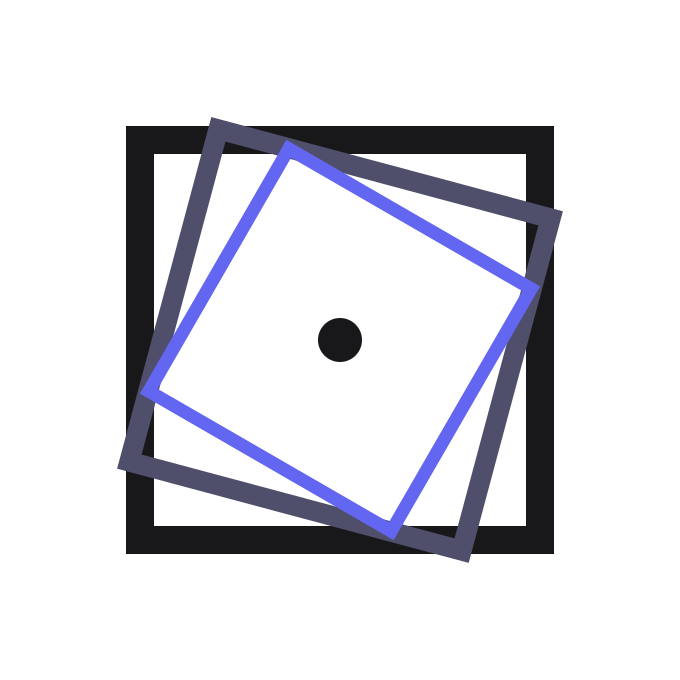

# Katas For Knowledge Distillation

A personal tool for tracking and practicing coding katas.

---

## Branches
 
| Branch | Description |
|---|---|
| `main` | Full app — Go backend + Next.js frontend with SQLite |
| `demo` | Static frontend-only demo, deployable to GitHub Pages |
 
---
 
## `main` — full app
 
### Stack
 
| Layer | Tech |
|---|---|
| Backend | Go, SQLite (bun ORM) |
| Frontend | Next.js 15, TypeScript, Tailwind v4, shadcn/ui |
| Package manager | pnpm |
 
### Prerequisites
 
- Go 1.22+
- Node.js 18+
- pnpm — `npm install -g pnpm`
### Run
 
**1. Clone**
 
```bash
git clone https://github.com/maabedelhay/kfkd.git
cd kfkd
```
 
**2. Start the backend**
 
```bash
go build -o main ./backend/...
./main
```
 
Backend runs on `http://localhost:8083`.
 
**3. Install and start the frontend**
 
```bash
cd frontend
pnpm install
pnpm dev
```
 
Frontend runs on `http://localhost:3000`.
 
### Stop
 
Kill the backend with `Ctrl+C` in its terminal, same for the frontend.
 
If the frontend port stays occupied:
 
```bash
kill -9 $(lsof -ti :3000)
```
 
---
 
## `demo` — static GitHub Pages deploy
 
The demo branch serves a static HTML preview with mock data and no backend.
 
### Build locally
 
```bash
git checkout demo
cd frontend
pnpm install
pnpm build
```
 
Output goes to `frontend/out/`. Open `frontend/out/index.html` in a browser or serve with:
 
```bash
python3 -m http.server -d frontend/out
```
 
### Deploy to GitHub Pages
 
```bash
git checkout demo
cd frontend && pnpm build && cd ..
git add .
git commit -m "your message"
git push origin demo
git subtree push --prefix frontend/out origin gh-pages
```
 
---
 
## API (`main` branch only)
 
| Method | Path | Description |
|---|---|---|
| `GET` | `/kata/list` | List all katas |
| `GET` | `/kata/{id}` | Get a single kata |
| `POST` | `/kata` | Create or update a kata (upsert on title, updates `content` and `note`) |
| `DELETE` | `/kata/{id}` | Delete a kata |
| `POST` | `/solve` | Record a solve attempt |
| `GET` | `/kata/solved` | Daily solve counts for the last 6 months |
 
### Kata payload
 
`content` and `note` must be **base64-encoded**. The frontend handles this automatically.
 
```json
{
  "title": "Fibonacci",
  "content": "<base64>",
  "note": "<base64>",
  "difficulty": "medium",
  "lines": 12,
  "tags": ["recursion", "math"]
}
```
 
### Solve payload
 
```json
{
  "kata_id": 1,
  "duration_sec": 420,
  "quality": 4
}
```
 
---
 
## License
 
MIT
